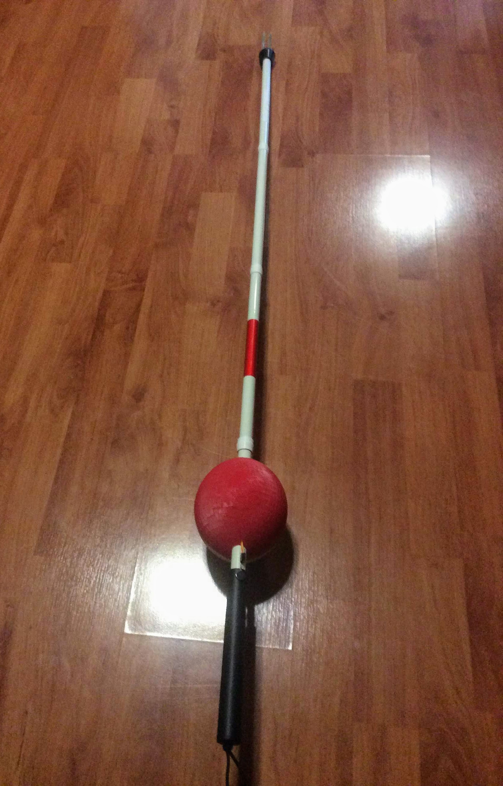

An Innovative Project that combines computer science knowledge with my hardware knowledge to create a cane that can help blind people avoid injuries in the winter. The device works by using various sensors to detect reflections of light, which helps to find if there is danger of ice in front of user. If there is, the cane notifies the user with vibrations. 

To view more photos please click link below:
https://photos.app.goo.gl/M7tcETBMAhuXKkm8A 
